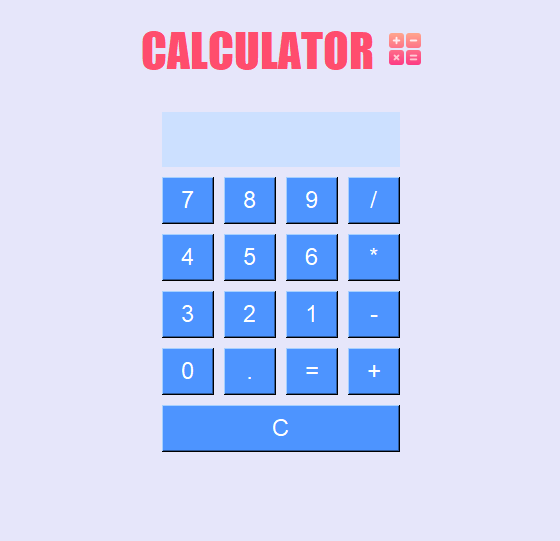

# Task 2: Simple Calculator

## Table of Contents

1. [Overview](#overview)
2. [Application Screenshot](#application-screenshot)
3. [Features](#features)
4. [Technologies Used](#technologies-used)
5. [Getting Started](#getting-started)
   - [Prerequisites](#prerequisites)
   - [Installation](#installation)
   - [Usage](#usage)
6. [Code Structure](#code-structure)
7. [Contact Information](#contact-information)

## Overview

Welcome to the repository for the Simple Calculator Application developed during my CodSoft Python Programming Internship. This project demonstrates a functional calculator with a graphical user interface (GUI) using the Tkinter library in Python. The calculator provides basic arithmetic operations including addition, subtraction, multiplication, and division. It also includes a clear button and an equals button to evaluate expressions.

## Application Screenshot

Here is a screenshot of the application:



## Features

- **Basic Arithmetic Operations**: Supports addition, subtraction, multiplication, and division.
- **Clear Button**: Allows users to clear the current input.
- **Equals Button**: Evaluates and displays the result of the current expression.
- **Responsive GUI**: User-friendly interface with a clean layout for easy operation.

## Technologies Used

- **Programming Language**: Python 3.x
- **Libraries**: 
  - `tkinter` (for creating the GUI)

## Getting Started

### Prerequisites

Ensure you have Python 3.x installed on your system. You can download it from [python.org](https://www.python.org/downloads/).

### Installation

1. Clone this repository to your local machine:
   ```bash
   git clone https://github.com/RiyaJ05/CodSoft_Internship_Task_2_Calculator

2. Navigate to the project directory:
   ```bash
   cd simple_calculator

### Usage

1. Run the application:
   ```bash
   python main.py

2. Use the calculator:
- **Click** on the number buttons to input numbers.
- **Click** on the arithmetic operation buttons (+, -, *, /) to input operators.
- **Click** on the equals button (=) to evaluate the expression.
- **Click** on the clear button (C) to reset the input.

## Code Structure
- **'TextLabel' Class:** Encapsulates the creation of a Label widget with customizable properties.
- **'MainFrame' Class:** Creates a Frame widget to organize the layout of the calculator.
- **'DisplayEntry' Class:** Manages the Entry widget where calculations are displayed.
- **'CalcButton' Class:** Creates buttons for the calculator with customizable properties.
- **'ButtonController' Class:** Handles the functionality of calculator buttons including display, result calculation, and clearing the entry.

## Contact Information
If you have any questions or feedback, feel free to reach out:

1. Email: riyajohari@gmail.com
2. LinkedIn: [Riya Johari](https://www.linkedin.com/in/riya-johari-547181259/)
3. GitHub: [RiyaJ05](https://github.com/RiyaJ05)
